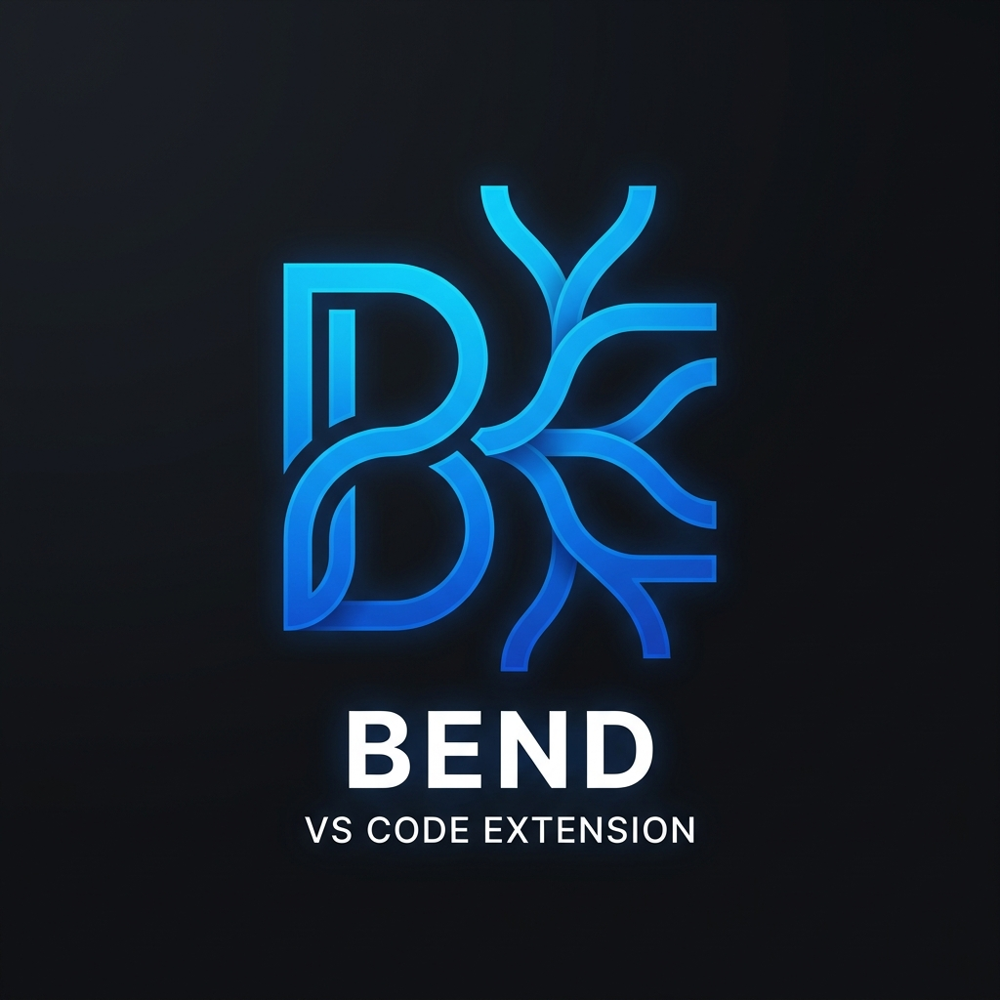

  

<h1 align="center">Bend Language Support for VS Code</h1>

  <em>A community-driven, enterprise-grade VS Code extension for the <a href="https://github.com/HigherOrderCO/Bend">Bend</a> programming language.</em>

---

## 🚀 Features

This extension brings a full IDE experience to Bend developers by leveraging a custom Language Server Protocol (LSP) backend.

*   **Intelligent Language Server**: Fast, background syntax validation using `bend check` that won't block your editor's UI thread.
*   **Rich Syntax Highlighting**: Comprehensive TextMate grammar that accurately colors types, definitions, variables, operators, and control structures.
*   **Hover Documentation**: Instantly view documentation for Bend's core primitives (`bend`, `fold`, `fork`, `switch`, `match`, etc.) by hovering over them.
*   **Document Outline**: Quickly navigate large files using the VS Code Outline view or Breadcrumbs (powered by Document Symbols).
*   **Execution Engine**: Run your `.bend` files directly from the editor! Click the **"Run this file (Bend)"** CodeLens link above your `def main` function, or use the editor context menu.
*   **Environment Detection**: A discrete Status Bar item tracks your active compiler path and default runtime (CPU/GPU).

## 📋 Requirements

You must have the `bend` executable installed and accessible in your system's `PATH`.
*   [Install Bend via Cargo](https://github.com/HigherOrderCO/Bend#installation)
*   **Note**: If your `bend` binary is not in your global PATH, you can explicitly set its location using the `bend.executablePath` setting.

## ⚙️ Configuration

This extension contributes the following settings:

| Setting | Type | Default | Description |
|---|---|---|---|
| `bend.executablePath` | `string` | `"bend"` | The path to the `bend` executable. |
| `bend.defaultRunner` | `enum` | `"c"` | The runtime backend to use when executing files.   `c` = Parallel CPU   `rs` = Sequential CPU   `cu` = Parallel GPU (CUDA) |

## 🛠️ Developing and Contributing

This extension is open source. Pull requests are welcome!

1. Clone the repository: `git clone https://github.com/dpuig/vscode-bend.git`.
2. Install dependencies: `npm install`
3. Press `F5` in VS Code to launch the Extension Development Host.

### Architecture
Built on a standard Client/Server LSP architecture (similar to `typescript-go`). The UI client focuses strictly on editor components, while the Node.js background server handles AST parsing and child process management.

## 📄 License

[MIT License](LICENSE) © The vscode-bend Authors
